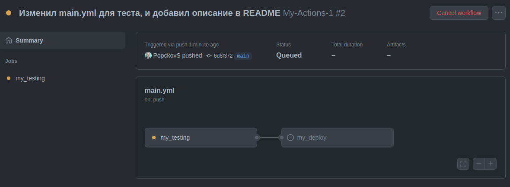
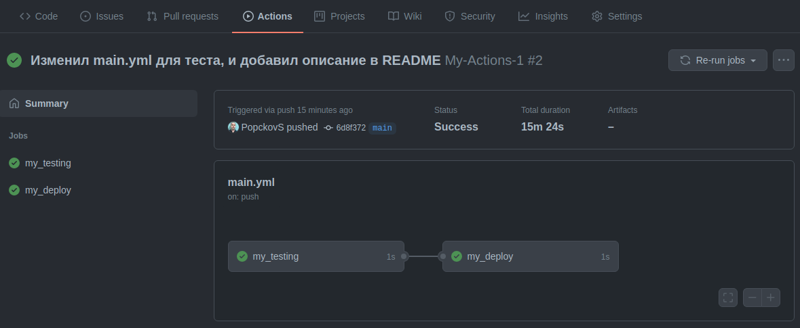

github-CI-CD
---
Данный репозиторий создан для тестирования работы CI / CD

---
GitHub Actions - инструмент github для создания CI / CD, во
вкладке Actions жно получить доступ к GUI через который и будем
работать.

workflow - это порядок определяющий как надо работать с Actions,
и порядок их выполнения.

К примеру можно настроить автоматические тесты и деплой, привязанный
к примеру на деплой в определенную ветку.

Делается это все при помощи спец файла с инструкциями, в формате
`YAML` который добавляется в репозиторий `.github/workflow/`

В самом Actions есть возможность как добавить свой собственный
workflow так и с уже прописанными настройками для различных
облачных серверов: Amazon ECS, IBM Cloud Kubernetes, Azure Web App,
Kubernetes Engine, Terraform ...

---
Как именно называть сам файл не имеет значения, создадим один такой 
`yaml` файл и в нем создадим настройки.

Создадим `main.yml` файл для таксов :
```yaml
# -------------------------------------------------------------
# Githab Actions Part-1 
# Popckov Sergey
# -------------------------------------------------------------

# ===== Название ======
# В отличии от названия файла, название "name" имеет значение,
name: My-Actions-1


# ===== Когда запускать ======
# Контролирует когда будет запускаться этот файл, на "push" или
# на "pull_request" 
on:
  
  # Тут же можно конкретизировать, в какой момент запускать и 
  # для какой ветки. Запускать при событии "push" в ветку "main"
  push:
    branches: [ main ]


# ===== Задания для работы ======
# Тут описаны задания которые будут выполняться при запуске файла,
# задачи могут выполняться как параллельно так и последовательно.
jobs:
  
  
  # Первое задание 
  # Это задача, она может называться как угодно, каждая такая задача
  # запускается на отдельной виртуальной машине, которую создает github 
  # и тут дальше описывается работа для Docker в котором будет выполнятся
  # вся работа этого задания.  
  my_testing:
    # На какой ОС будет запущено задание, к примеру можно запустить на
    # runs-on: ubuntu-latest последней ОС или на указанной точно.
    runs-on: ubuntu-18.04

    # Шаги для работы в задании.   
    steps:
      # Название конкретного шага
      - name: Print Message 1
        # Действие внутри конкретного шага, по сути пишим обычный shell         
        run: echo "Hello World from my_testing"
        

  # Второе задание  
  my_deploy: 
    runs-on: ubuntu-18.04
    steps:
      - name: Print Message 2
        run: echo "Hello World from my_deploy"
```

При `push` в репозиторий, сработает `Actions` и все процессы выполнения
заданий с выводом результатов команд, можно будет увидеть в отладке.

При этом по дефолту каждое из заданий будет выполнятся в своем образе 
`Docker`, и параллельно друг другу, чтобы это изменить, мы можем указать 
определенному заданию, после какого именно задания ему следует быть
выполненным, для этого добавим параметр `needs: [название_таска]`.

```yaml
  my_deploy: 
    runs-on: ubuntu-18.04
    # Выполнить задание my_deploy после выполнения задания my_testing
    needs: [my_testing]
    steps:
      - name: Print Message 2
        run: echo "Hello World from my_deploy"
```

Тогда при обработке задания, можно увидеть в отладке, как связаны таски
между собой, по порядку выполнения.



Сразу после выполнения заданий, можно увидеть как задания помечаются
как выполненные.



---
Добавим переменные окружения, делается это в блоке `env` который 
определяется на верхнем уровне файла `YAML`, добавим этот блок, 
в этом блоке мы можем определять свои собственные переменные, 
но можем добавлять к ним и специальные зарегистрированные переменные,
что определены в самом `Github`.

К примеру `${{github.sha}}` позволяет обратится к уникальному `SHA`
ключу, который генерируется специально для каждого коммита, на основе
суммы всех хешированных изменений сделанных в этом коммите.

```yaml
name: My-Actions-1

env:
  APPLICATION_NAME: "MyFlask"
  DEPLOY_PACKAGE_NAME: "flask_deploy_version-${{github.sha}}"

on:
  push:
    branches: [ main ]
```

Эти специальные переменные можно использовать прямо в заданиях,
обращаясь к ним следующим образом `${{env.APPLICATION_NAME}}`

```yaml
  my_testing:
    runs-on: ubuntu-18.04   
    steps:
      - name: Print Message 1
        run: echo "Hello World from my_testing"
      - name: Print APPLICATION_NAME
        run: |
          echo "Hello 1"
          echo "Hello 2"
          echo "APPLICATION_NAME: ${{env.APPLICATION_NAME}}"

  my_deploy: 
    runs-on: ubuntu-18.04
    needs: [my_testing]
    steps:
      - name: Print Message 2
        run: echo "Hello World from my_deploy"
      - name: Print DEPLOY_PACKAGE_NAME
        run: |
          echo "Hello 3"
          echo "Hello 4"
          echo "DEPLOY_PACKAGE_NAME : ${{env.DEPLOY_PACKAGE_NAME}}"
```


